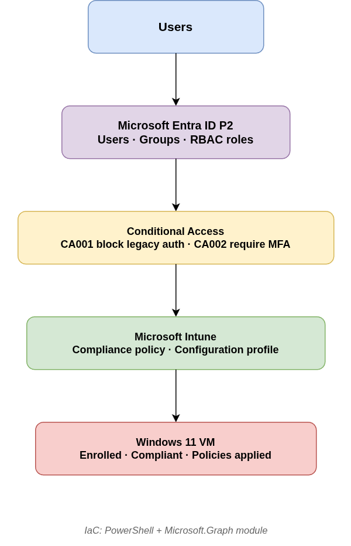
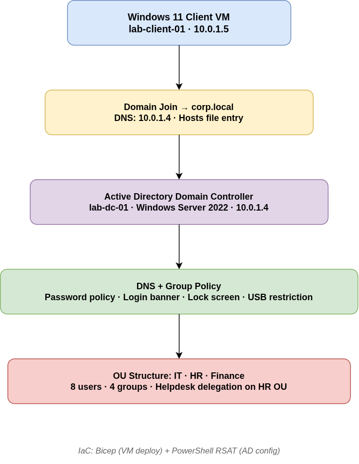

# Mini Enterprise Lab

A fully scripted, portfolio-ready enterprise IT environment built from scratch on a zero-to-minimal budget. Demonstrates cloud identity, device management, on-premises Active Directory, Group Policy, and infrastructure-as-code across two connected environments.

---

## What this project demonstrates

- Cloud identity and access management with Microsoft Entra ID P2
- Conditional Access policy design and verification
- Device compliance and configuration management with Microsoft Intune
- Active Directory Domain Services — forest design, OU delegation, Group Policy
- Infrastructure as code with PowerShell, Microsoft Graph API, and Azure Bicep
- Security hardening — MFA enforcement, legacy auth blocking, USB restriction, login banners
- Real-world scripting patterns — idempotent scripts, secret management, parameterised deployments

---

## Architecture

### Environment 1 — Cloud (Entra ID + Intune)




### Environment 2 — On-premises AD DS (Azure-hosted)




### Future — Phase 4

AD DS ──Entra Connect──→ Entra ID


Hybrid identity sync connecting both environments — users created once in AD DS, replicated automatically to Entra ID.

---

## Tech stack

| Layer | Technology |
|---|---|
| Cloud identity | Microsoft Entra ID P2 |
| Device management | Microsoft Intune |
| Conditional Access | Entra ID Conditional Access |
| On-prem directory | Active Directory Domain Services |
| Operating systems | Windows Server 2022, Windows 11 Pro |
| IaC — Azure | Bicep + Azure CLI |
| IaC — identity | PowerShell 7 + Microsoft.Graph module |
| IaC — AD DS | PowerShell + RSAT AD module |
| Version control | GitHub |
| Development OS | Ubuntu 24.04 |

---

## Repository structure

```
mini-enterprise-lab/
│
├── entra-intune/
│   ├── scripts/
│   │   ├── create-users.ps1          # 8 users via Graph API
│   │   ├── create-groups.ps1         # 3 security groups
│   │   ├── add-group-members.ps1     # department-based membership
│   │   ├── assign-roles.ps1          # RBAC role assignments
│   │   ├── conditional-access.ps1    # CA001 + CA002 policies
│   │   └── intune-policies.ps1       # compliance + config profiles
│   ├── docs/
│   │   ├── setup-guide.md
│   │   ├── architecture.md
│   │   └── ca-test-results.md
│   └── diagrams/
│       └── entra-architecture.png
│
├── adds/
│   ├── bicep/
│   │   ├── deploy-vm.bicep           # generic reusable VM template
│   │   └── deploy.template.sh        # parameter-driven deployment wrapper
│   ├── scripts/
│   │   ├── install-ad.ps1            # AD DS role + forest promotion
│   │   ├── create-ou.ps1             # OUs, users, groups, delegation
│   │   └── gpo-config.ps1            # 4 GPOs created and linked
│   ├── docs/
│   │   ├── setup-guide.md
│   │   └── architecture.md
│   └── diagrams/
│       └── adds-architecture.png
│
├── lab.config.template.ps1           # config template — fill and rename to lab.config.ps1
├── .gitignore                        # excludes lab.config.ps1 and deploy.sh
└── README.md
```


---

## Identity structure

| User | Department | Group | Entra Role |
|---|---|---|---|
| Alex Morgan | IT | GRP-IT | Global Reader |
| Jordan Blake | IT | GRP-IT | Helpdesk Administrator |
| Taylor Reed | HR | GRP-HR | — |
| Morgan Ellis | HR | GRP-HR | — |
| Casey Quinn | HR | GRP-HR | — |
| Riley Grant | Finance | GRP-Finance | — |
| Avery Stone | Finance | GRP-Finance | — |
| Drew Hale | Finance | GRP-Finance | — |

AD DS additionally has GRP-Helpdesk with delegated password reset rights on OU=HR only.

---

## Conditional Access policies

| Policy | Scope | Condition | Action | State |
|---|---|---|---|---|
| CA001 — Block legacy auth | All users | Legacy client apps | Block | Report-only |
| CA002 — Require MFA | All users (excl. admin) | Browser + modern apps | Require MFA | Report-only |

Verified via Entra ID sign-in logs — CA001 shows Not applied on browser sign-ins, CA002 shows User action required.

---

## Group Policy objects

| GPO | Linked to | What it enforces |
|---|---|---|
| GPO-Password-Policy | Domain | 12 char min, complexity, 90 day expiry, lockout after 5 attempts |
| GPO-Login-Banner | Domain | Legal warning before every login — verified on DC |
| GPO-Lock-Screen | IT, HR, Finance OUs | 5 minute inactivity timeout with password required |
| GPO-USB-Restriction | Finance OU | Deny write access to removable storage (logical + physical layer) |

---

## How to reproduce this environment

### Prerequisites

- Azure subscription (free account works)
- Ubuntu 22.04+ or any Linux/macOS machine
- PowerShell 7+ (`sudo snap install powershell --classic`)
- Azure CLI (`curl -sL https://aka.ms/InstallAzureCLIDeb | sudo bash`)
- Microsoft.Graph PowerShell module (`Install-Module Microsoft.Graph -Scope CurrentUser`)

### 1. Configure secrets

```bash
cp lab.config.template.ps1 lab.config.ps1
# Fill in your tenant domain, admin UPN, and passwords
nano lab.config.ps1
```

### 2. Deploy cloud environment

```powershell
# Connect to your tenant
Connect-MgGraph -Scopes "User.ReadWrite.All","Group.ReadWrite.All","Policy.ReadWrite.ConditionalAccess","RoleManagement.ReadWrite.Directory","DeviceManagementConfiguration.ReadWrite.All"

# Run scripts in order
./entra-intune/scripts/create-users.ps1
./entra-intune/scripts/create-groups.ps1
./entra-intune/scripts/add-group-members.ps1
./entra-intune/scripts/assign-roles.ps1
./entra-intune/scripts/conditional-access.ps1
./entra-intune/scripts/intune-policies.ps1
```

### 3. Deploy AD DS environment

```bash
# Copy and fill in deployment wrapper
cp adds/bicep/deploy.template.sh adds/bicep/deploy.sh
nano adds/bicep/deploy.sh

# Deploy domain controller
bash adds/bicep/deploy.sh dc

# Deploy client VM
bash adds/bicep/deploy.sh client
```

```powershell
# RDP into DC, then run scripts in order
& "C:\Scripts\install-ad.ps1"    # promotes forest corp.local
& "C:\Scripts\create-ou.ps1"     # OUs, users, groups, delegation
& "C:\Scripts\gpo-config.ps1"    # GPOs created and linked
```

---

## Key design decisions

See `adds/docs/architecture.md` and `entra-intune/docs/architecture.md` for full reasoning. Highlights:

- **corp.local vs routable domain** — non-routable internal name avoids DNS conflicts. Trade-off: requires extra config for Entra Connect hybrid sync. Production preference is a routable subdomain like `ad.yourdomain.com`.
- **Report-only CA policies** — both CA policies intentionally stay in report-only mode. Verified via sign-in logs before enabling. Prevents accidental lockout.
- **-BodyParameter pattern** — all Graph API cmdlets use `-BodyParameter` hashtables instead of individual parameters. More reliable across module versions, mirrors REST API directly.
- **Client-side filtering** — `Department` is not an indexed property in Entra ID. Server-side `-Filter` silently returns nothing. All user filtering uses `Get-MgUser -All -Property` piped to `Where-Object`.
- **Separate IaC config file** — all sensitive values in `lab.config.ps1` which is gitignored. A safe template is committed. No secrets ever touch version control.
- **Dual user creation** — users exist in both Entra ID and AD DS because the environments are currently isolated. Entra Connect (Phase 4) eliminates this by syncing AD DS identities to Entra ID automatically.

---

## Challenges and lessons learned

Nine real blockers hit and resolved during this build — documented in full in the session summary. Key lessons:

- Entra ID P2 and Intune are separate trial activations — activating one does not activate the other
- Graph API returns minimal properties by default — always use `-Property` for optional fields
- Azure RBAC and Entra ID roles are completely separate control planes — Global Admin gives no Azure resource access
- GPO password policy via registry only affects local accounts — domain account passwords require `Set-ADDefaultDomainPasswordPolicy`
- USB restriction requires blocking both logical `{53f5630d}` and physical `{53f56311}` device class GUIDs

---

## Future work — Phase 4

- **Entra Connect hybrid sync** — install on DC, configure password hash sync, verify AD DS users replicate to Entra ID automatically
- **Enable CA policies** — move CA001 and CA002 from report-only to enabled after MFA registration is confirmed
- **LAPS** — Local Administrator Password Solution via GPO for client VM local admin account rotation
- **Autopilot** — complete OOBE reset simulation with User-Driven deployment profile

---

## Cost

| Item | Cost |
|---|---|
| Entra ID P2 trial | $0 |
| Intune trial | $0 |
| Azure DC VM (stopped when idle) | ~$1–5/mo |
| Azure client VM (stopped when idle) | ~$1–5/mo |
| GitHub | $0 |
| **Total** | **$0–10/mo** |